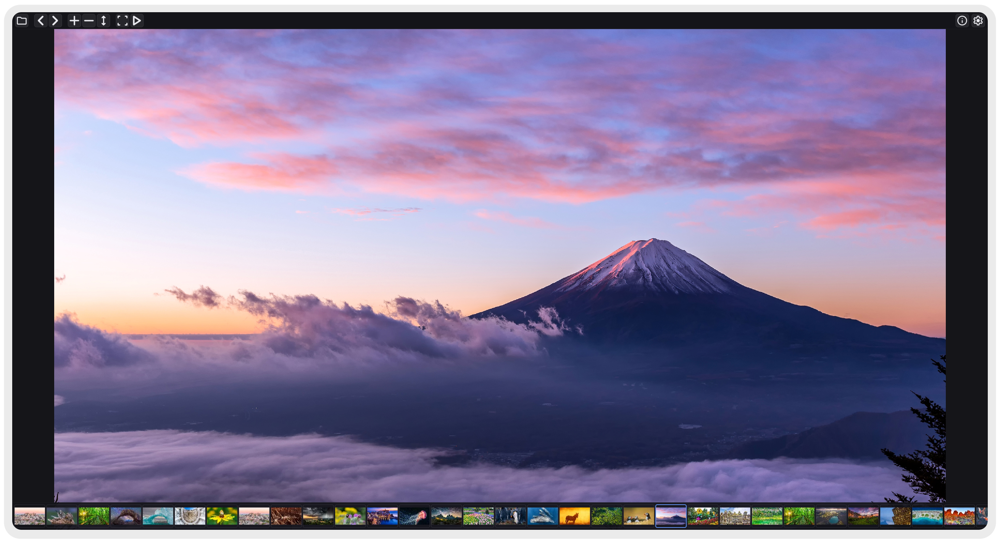

# Horizon Photo Viewer

Wayland photo viewer with Vulkan, zoom/pan, and a clean toolbar. Ships as a single binary — **`horizon-photo-viewer`**.

## Features

- Vulkan rendering with pixel-sharp filtering
- Drag to pan, scroll to zoom, Ctrl+0/1 to fit or go 1:1
- Thumbnail strip shows other images in the folder — appears on hover in fullscreen
- Slideshow with configurable speed
- Settings popup for background opacity, color management, theme
- Metadata sidebar with EXIF info (camera, lens, aperture, ISO, date)
- Fullscreen and slideshow hide the UI, but it pops back when you move the mouse

Full breakdown per distro in the [platform docs](Docs/Arch-Linux.md).

## Build deps

You need a C++23 compiler, **Meson**, and **Ninja**. Grab the right packages for your distro:

- [Arch](Docs/Arch-Linux.md)
- [Fedora](Docs/Fedora.md)
- [Debian / Ubuntu](Docs/Debian-Ubuntu.md)

If configure barfs, just install whatever `-dev` / `-devel` package it asks for.

## Optional decoders

Pass `-D<name>=true` to meson to enable:

- `jpeg` — libjpeg (JPEG)
- `webp` — libwebp (WebP)
- `heif` — libheif (HEIC/HEIF)
- `avif` — libavif (AVIF)
- `raw` — libraw (camera RAW)
- `jxl` — libjxl (JPEG XL)
- `metadata` — exiv2 (EXIF metadata)
- `color_management` — lcms2 (ICC profiles)

Built-in (no extra deps): **Wuffs** handles PNG, GIF, BMP, TIFF, and baseline JPEG.
